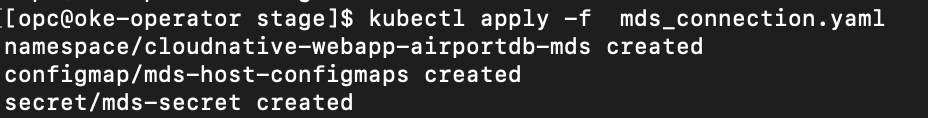

# Lab 4: Deploy application on Kubernetes

## Introduction

**Oracle Container Engine for Kubernetes (OKE)** is an Oracle-managed container orchestration service that can reduce the time and cost to build modern cloud native applications. Unlike most other vendors, Oracle Cloud Infrastructure provides Container Engine for Kubernetes as a free service that runs on higher-performance, lower-cost compute shapes. 

In this lab, you will deploy a PHP application on **OKE**, and connect it to **MDS**.

Estimated lab time: 15 minutes

## Task 1: Verify OKE cluster

1. Click the **Navigation Menu** in the upper left, navigate to **Developer Services** and select **Kubernetes Cluster (OKE)**


2. Select the Compartment (e.g. PHP-Compartment) that you provisioned the OKE cluster, and verify that the status of OKE cluster 'oke_cluster' is Active


3. Click 'oke_cluster' to view the status of the OKE cluster and the worker nodes in your OKE cluster. You will deploy a PHP application to this OKE cluster soon.


## Task 2: Connect to **oke-operator** compute instance

1. Connect to the **oke-operator** compute instance again using OCI Cloud Shell as in [Lab 3](../lab3/README.md)

## Task 3: Deploy Application to OKE

1. Download yaml deployment file [mds_connection.yaml](mds_connection.yaml) to the operator VM.

```
wget https://raw.githubusercontent.com/kuanrcl/mysql-migration/main/lab4/mds_connection.yaml
```

2. Update parameter **“mds-host”** in mds_connection.yaml. Replace "\<IP ADDRESS>" below with the IP address of your MDS instance, and execute the script.
   
```
sed -i 's/mds-host: "<TO BE SET>"/mds-host: "<IP ADDRESS>"/g' mds_connection.yaml
```

For example, if the IP address of your MDS instance is "10.0.30.41", your script should be:
```
sed -i 's/mds-host: "<TO BE SET>"/mds-host: "10.0.30.41"/g' mds_connection.yaml
```


3. (Skip this step if you use default password  for MDS) Update parameter **“mds-password”** in mds_connection.yaml. Replace "\<MDS Password>" with the password you gave when provisioning MDS in Resource Manager, and execute the script.

```
sed -i 's/Oracle#123/<MDS Password>/g' mds_connection.yaml
```

For example, if your new password is "MySQL#12345", your script should be:

```
sed -i 's/Oracle#123/MySQL#12345/g' mds_connection.yaml
```

4. Print your mds_connection.yaml file and verify it has the correct IP address and password for MDS.

```
cat mds_connection.yaml
```


5. Create Kubernetes configmap and secret to store MDS connection metadata.
```
kubectl apply -f  mds_connection.yaml
```


6. Download yaml deployment file [deploy_webapp.yaml](deploy_webapp.yaml).

```
wget https://raw.githubusercontent.com/kuanrcl/mysql-migration/main/lab4/deploy_webapp.yaml
```

7. Deploy the PHP application into OKE.
```
kubectl apply -f deploy_webapp.yaml
```


8. Check the status of pods and wait until all pods are up and running
```
kubectl -n cloudnative-webapp-airportdb-mds get pod
```


9. Get the external IP address of your load balancer. Wait 30 seconds if the external IP address is not ready.
```
kubectl -n cloudnative-webapp-airportdb-mds get service --watch
```
Once you have the External IP provisioned, you can execute CTL+C to kill the command


## Task 4: Access the Application 

1. Open a browser and access your PHP application using the external IP address. (e.g. http://xxx.xxx.xxx.xxx:5000/index.php). You will get a page to submit SQL statement against MDS.


2. Submit a SQL statement to verify that PHP application connects well with MDS.
```
SELECT
airline.airlinename,
AVG(datediff(departure,birthdate)/365.25) as avg_age,
count(*) as nb_people
FROM
booking, flight, airline, passengerdetails
WHERE
booking.flight_id=flight.flight_id AND
airline.airline_id=flight.airline_id AND
booking.passenger_id=passengerdetails.passenger_id AND
country IN ('GERMANY', 'SPAIN', 'GREECE')
GROUP BY 
airline.airlinename
ORDER BY 
airline.airlinename, avg_age
LIMIT 10;
```
 
3. After a while, you should get the query result together with the execution time. Note down the execution time, you will see performance improvement in next lab after HeatWave is enabled.


## It works

You just deployed and tested applications on Kubernetes

## Congratulations, you are ready for the next Lab!

[Home](../README.md) | [**Go to Lab 5 >>>>>**](../lab5/README.md)
